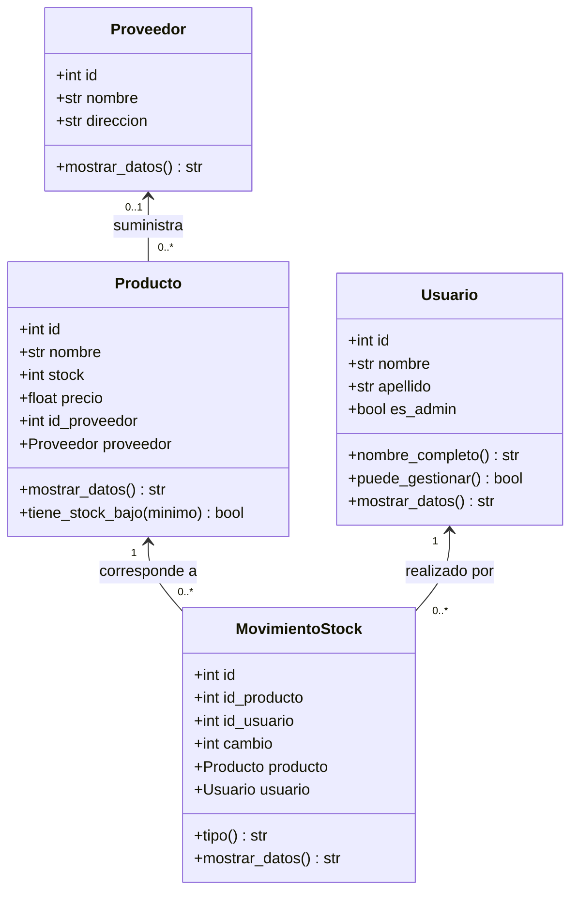

# Diseño de clases de la fase 4

El sistema representa los cuatro elementos definidos en las etapas anteriores
del minimercado El Barrio. Cada clase tiene una responsabilidad concreta y
conserva la correspondencia con las tablas de MySQL, sin agregar campos que
todavía no existen en la base de datos.

## Clases elegidas

| Clase | Justificación y responsabilidad | Tabla |
| --- | --- | --- |
| `Producto` | Describe un artículo, su stock actual, precio y proveedor. Permite consultar sus datos y detectar stock bajo. | `product` |
| `Proveedor` | Reúne el nombre y la dirección de quien suministra artículos. Evita repetir estos datos como variables sueltas. | `proveedores` |
| `Usuario` | Describe a la persona que utiliza el sistema y distingue administrador y empleado mediante el campo existente `admin`. | `users` |
| `MovimientoStock` | Representa un ingreso o una salida ya registrada y vincula el producto con la persona que la realizó. | `movimientos` |

## Atributos y métodos

Los identificadores conservan la referencia a las claves primarias y foráneas.
Los constructores reciben los nombres de campos de la etapa 2 y los guardan
en atributos en español.

| Clase | Atributos de instancia | Métodos principales |
| --- | --- | --- |
| `Producto` | `id`, `nombre`, `stock`, `precio`, `id_proveedor`, `proveedor` | `__init__`, `mostrar_datos()`, `tiene_stock_bajo(minimo=5)` |
| `Proveedor` | `id`, `nombre`, `direccion` | `__init__`, `mostrar_datos()` |
| `Usuario` | `id`, `nombre`, `apellido`, `es_admin` | `__init__`, `nombre_completo()`, `puede_gestionar()`, `mostrar_datos()` |
| `MovimientoStock` | `id`, `id_producto`, `id_usuario`, `cambio`, `producto`, `usuario` | `__init__`, `tipo()`, `mostrar_datos()` |

`mostrar_datos()` devuelve texto, que `main.py` imprime. Esto separa los objetos
de la presentación por consola y facilita reutilizarlos.

`tiene_stock_bajo()` devuelve verdadero cuando el stock es menor o igual al
umbral indicado. El mínimo predeterminado es 5; no se agrega una columna de
stock mínimo en esta fase.

`puede_gestionar()` consulta el indicador de administrador. Describe el rol;
la autenticación y la aplicación de permisos se implementarán en la fase 6.

`tipo()` interpreta `cambio`: positivo significa entrada, negativo salida y
cero sin cambio. `MovimientoStock` describe el registro recuperado; no modifica
ni guarda stock. El stock del objeto Producto representa el valor actual de
la tabla, no una reconstrucción del stock al momento de cada movimiento.

## Diagrama de clases

El bloque Mermaid puede visualizarse en un editor compatible, como la vista
previa de Markdown de GitHub. Se incluye una representación textual debajo.



```text
Proveedor <--- Producto <--- MovimientoStock ---> Usuario
             proveedor        producto           usuario
```

Un proveedor puede suministrar varios productos; cada movimiento pertenece a
un producto y a un usuario. `Producto.proveedor`, `MovimientoStock.producto`
y `MovimientoStock.usuario` contienen objetos, además de conservar los IDs.
El diseño del negocio prevé un proveedor por producto. La base anterior admite
`NULL` en esa clave; por eso se usa `LEFT JOIN` y se muestra «Sin proveedor»
si el producto no tiene uno asociado.

## Conexión y conversión de registros

`database.py` utiliza `mysql.connector` para abrir la conexión. Obtiene la
configuración de `.env` o del entorno y valida el puerto. `_consultar()` crea
un cursor de diccionarios, ejecuta el SELECT, recupera las filas y cierra el
cursor y la conexión en `finally`. Los errores MySQL se convierten en
`RuntimeError` para que el programa principal los informe sin un traceback.

Las funciones `obtener_productos()`, `obtener_proveedores()`,
`obtener_usuarios()` y `obtener_movimientos()` crean instancias de las clases.
El JOIN de productos aporta los datos para construir un `Proveedor`. El JOIN
de movimientos aporta los datos para construir su `Producto` y `Usuario`.
Los objetos relacionados se crean para cada fila; no hay una caché compartida
de instancias entre consultas.

Por ejemplo, una fila con `product_name='Teclado mecanico'`, `stock=15` y
`proveedor_name='Distribuidora Norte'` se convierte en un `Producto` con un
objeto `Proveedor`. Su método `mostrar_datos()` devuelve:

```text
Teclado mecanico | Stock: 15 | Precio: $25000.00 | Proveedor: Distribuidora Norte
```

La demostración es de lectura: no cambia los datos existentes. Las operaciones
para modificar precios, controlar cambios de stock y proteger atributos se
desarrollarán con el encapsulamiento de la fase 5. Las claves identifican los
registros y no deberían modificarse durante el uso de los objetos.
